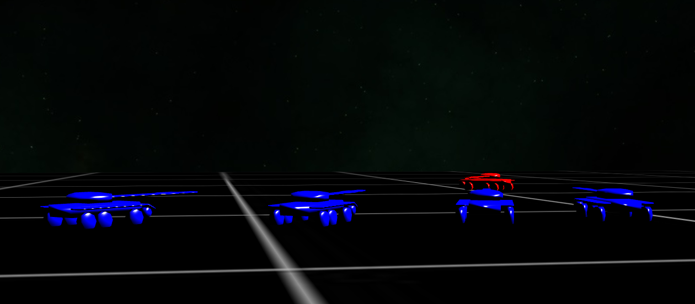
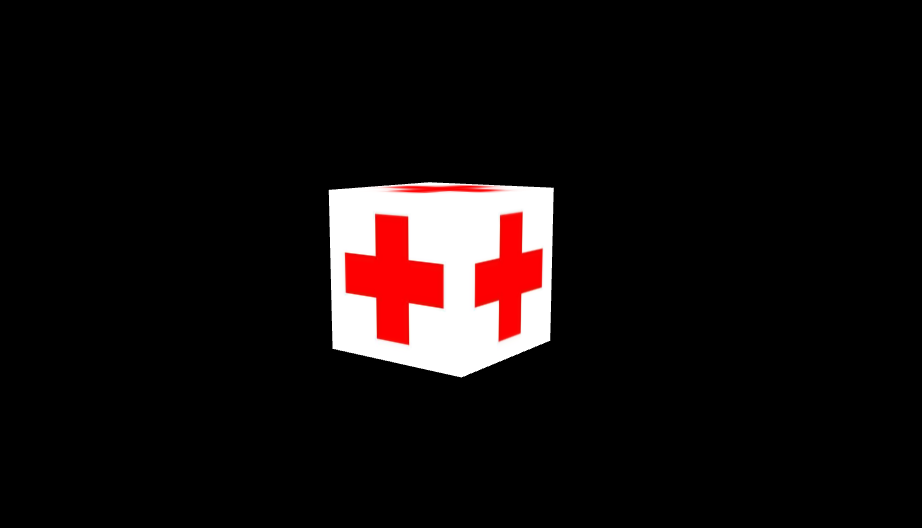
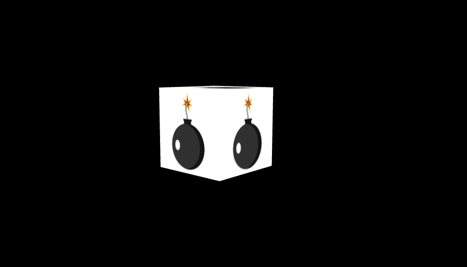
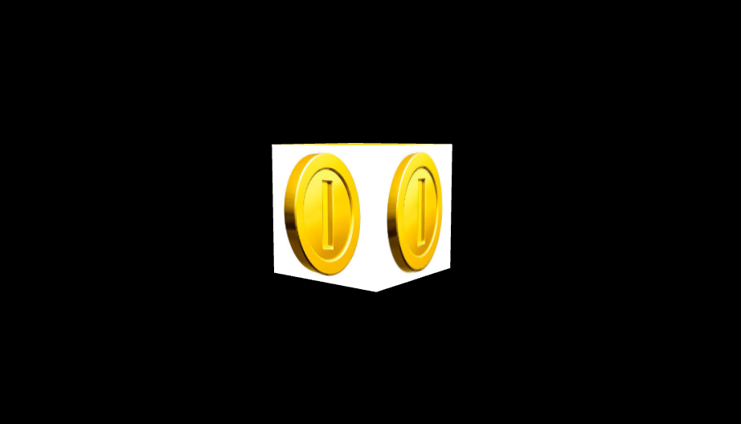

# Interactive graphics MiniGame

## The game
The game is a simple third person arena game in which the player tank and the blue tank team fight to the death. 

  

    

 

The arena is a simple flat map in which the tanks are able to move. Both the player tank and the opponent team can shoot with two weapons: the cannon and the machine gun. The player tank is also able to restore life points, to collect cannon and machine gun bullets from the loot boxes that float in certain positions of the map.
 

  

    
  

  

    
  

 

The goal of the player tank is to **collect a sufficient number of points** to win the stage. The amount of points needed to win changes with the game difficulty which can be either **easy** or **hard**. In easy mode the player needs to collect 5 points whereas in hard mode the points needed are 10. The player can collect points by picking the *point loot boxes* which are easily spotted by a big gold coin texture. 

  

    

 
  
In easy mode, there are two point loot boxes that respawn after 5 seconds whereas in hard mode there is just one loot box making more difficult for the player to win the stage. The respawn time of the point loot box remains the same.
The player will face an opponent team of blue tanks that have the only purpose of killing him. Also the number of opponent tanks varies toghether with the game difficulty. In easy mode, there are just two tanks, in hard mode there are four of them. In each of the two game difficulties, the blue tanks will have infinite ammo for their weapons whereas the player tank has just few limited amount.

## Commands

* **W** : move forward/accelerate.
* **S** : move backward/break.
* **A** : turn left.
* **D** : turn right.
* **Left mouse** : shoot.
* **M** : main menu.
* **L** : free camera.
* **1** : switch to cannon.
* **2** : switch to the machine gun.
* **T** : Use tank follow camera.

## Play the game
Go to this link to play the game

https://sapienzainteractivegraphicscourse.github.io/final-project-ig_minigame/

    
    
    

